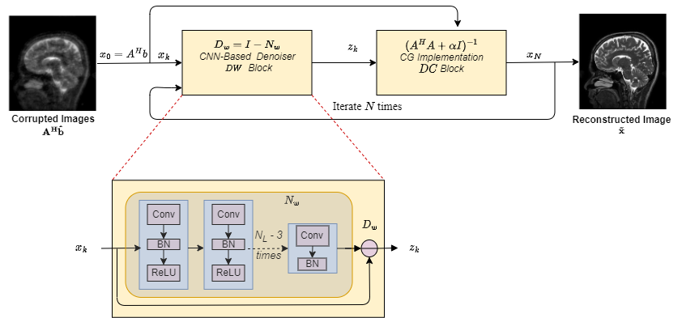

**DISCLAIMER:** This repository is only intended for editors and reviewers of the manuscript "<ins>Deep-learning-based reconstruction of undersampled MRI for multi-fold reduction of scan time: a multicenter retrospective cohort study in neuro-oncology</ins>". Do not use this repository outside the review process or distribute it. The repository will be made publicly available upon acceptance of the manuscript via https://github.com/NeuroAI-HD/dCNN-MRI-Reconstruction

The containerized version of this code will be released soon. 

Also, this repository is presently shared using Gitfront which doesn't support rendering latex mathematical symbols. This problem won't occur in the final repository shared using Github.

# dCNN-MRI-Reconstruction
Code for MR Image reconstruction using physics-based neural network.

This code solves the following optimization problem:

   

 
 `A` can be any measurement operator. Here we consider parallel imaging problem in MRI where
 the `A` operator consists of undersampling mask, FFT, and coil sensitivity maps.

`Dw(x)`: it represents the denoiser using a residual learning CNN.

## Training Data

MR exams from patients with glioblastoma treated at Heidelberg University Hospital (775 patients, 775 MRI -exams), within the phase-II CORE trial (260 patients, 1083 MRI exams-examinations, 59 institutions) and within the phase-III CENTRIC trial (504 patients, 3147 MRI- examinations, 149 institutions) were used to develop and train a dCNN for reconstructing MRI (pre- and postcontrast T1-w, T2-w and FLAIR sequences) from highly undersampled (retrospectively generated) single-coil k-space data with various acceleration rates (R=2-15). Specifically, the training data included:

1. A single-institutional retrospective dataset with 694 MRI examinations from 495 patients was acquired at the Department of Neuroradiology, Heidelberg University Hospital, Germany. Specifically, the HD cohort consisted of MRI exams from a single time point (one MRI exam per patient) either pre-operatively from initial diagnosis (n=580 (75%)), early postoperatively (less than 72 hours after surgery; n=57 (7%)) or at disease recurrence (n=138 (18%)).
2. The CORE <a href="#modl">[1]</a> and CENTRIC <a href="#modl">[2]</a> studies which were prospective multicenter randomized phase II and III trials in patients with newly diagnosed glioblastoma compared standard chemo-radiotherapy with/without anti-angiogenic treatment with cilengitide. Specifically, patients with O6-DNA methylguanine-methyltransferase (MGMT) unmethylated glioblastoma were included in the phase II CORE trial, whereas those with MGMT methylated glioblastoma were included in the phase III CENTRIC trial.

**The testing** was performed on the EORTC-26101 dataset (528 patients with 1974 MRI exams from 32 institutions all containing pre- and postcontrast T1-w, T2-w and FLAIR sequences). The EORTC-26101 <a href="#modl">[3]</a><a href="#modl">[6]</a> dataset is a multicentric clinical trial dataset with 2034 MRI examinations from 532 patients acquired across 34 institutions in Europe

HD-GLIO is very fast on GPU with <10s run time per MRI examination.
## Architecture

The architecture of the network used in this study is shown below

   

## MoDL: Model Based Deep Learning Architecture for Inverse Problems

**Reference Papaer**
MoDL: Model Based Deep Learning Architecture for Inverse Problems by Hemant et al. <a href="#modl">[5]</a>.

The algorithm used in this work is inspired by MoDL which was proposed for 2D reconstruction of MR images from undersampled k-space data. The architecture of MoDL is shown in Figure above. MoDL estimates reconstructed MR scans from undersampled data by solving a convex constraint optimization problem as shown in Equation above. The first term of the equation is the Data Consistency term and enforces the physical model of MR undersampling and the second term is the denoising-based prior, `Dw(x)`. The relative strength of the Denoising Prior over Data Consistency term is controlled by lagrangian multiplier $\alpha$ where $\alpha$ should be > 0. The network is trained by unrolling for a fixed number of iterations $N$ and the Deoising Prior `Dw(x)` and $\alpha$ are trainable parameters which are learned using supervised loss and the parameters are shared across all iterations.

## Improvements over MoDL

1. **Generalizable to 3D**: The network used in this study is capable of reconstructing 3D acquired sequences using a 3D undersampling mask. This also makes the prior more informative as the field of view for prior calculation increases.
2. **Improved Stability**: The network used in this study is more stable than MoDL while training. In classical MoDL the lagrangian parameter can fluctuate between positive and negative values which can blow up the loss values. This problem is addressed in the current networks. For solving any constraint optimization problem $\alpha$ has to be non-negative (strictly positive in our case). In the original implementation of MoDL there was no mechanism to restrict $\alpha$ to be positive and in our initial experiments, it was observed that $\alpha$ oscillates between positive and negative values during parameter updation. This leads to the divergence of neural network during training. The implementation was modified such that $\alpha$ remains positive.
3. **Improved Prior Learning**: The Data denoising block, which learns a denoising prior for MR reconstruction should only generate a noise prior from the input (output of data consistency layer at each iteration of dCNN). However, there is no guarantee for the Data denoising block to learn the noise prior instead of any other feature, which was observed during the experiments performed for this manuscript at higher undersampling rates.An explicit loss term was added between ground truth and the output of data denoising block to ensure that it learns a noise prior.
4. **Multi-gpu training**: Additionally, the implementation of existing MoDL was modified to support multi-gpu training by splitting the minibatch across multiple GPUs. This was necessary for 3D volume reconstruction.

Therefore the modified model is more stable, easier to train and can offer better convergence and performance.

## Installation

The algorithm is developed and tested on the Linux platform, execution on any other OS cannot be guaranteed. The dCNN algorithm uses TensorFlow 2.xx for execution. To install all libraries needed to execute dCNN for MRI reconstruction follow these steps:
1. Download the dCNN-MRI-Reconstruction repository from Github and extract the files.
2. Launch a terminal and change the path to the folder extracted in step 1.
3. Execution of this code requires Miniconda. To install Miniconda on a Linux system, follow these steps (if already installed skip to step 4):
   
   * **Download Miniconda**: Open a terminal and navigate to the directory where you want to download the Miniconda installer. Then, use curl or wget to download the Miniconda installer script. Replace <MINICONDA_VERSION> with the desired version, e.g., "latest" for the most recent version.

          wget https://repo.anaconda.com/miniconda/Miniconda3-<MINICONDA_VERSION>-Linux-x86_64.sh
     
   * **Run the Installer Script**: After downloading, you'll need to make the installer script executable and then run it. Use the following commands, replacing <MINICONDA_VERSION> with the actual version you downloaded:

         chmod +x Miniconda3-<MINICONDA_VERSION>-Linux-x86_64.sh
         ./Miniconda3-<MINICONDA_VERSION>-Linux-x86_64.sh
     
      This will start the installation process. You'll be asked to review the license agreement (press Enter to scroll through), and then you'll need to accept the license terms by typing "yes."

   * **Choose Installation Location**: The installer will ask where to install Miniconda. The default location is usually your home directory. You can press Enter to accept the default or specify a different location if needed.

   * **Initialize Miniconda**: After installation, you may need to initialize Miniconda in your terminal. Run the following command:

          source ~/.bashrc
    
      This will update your shell environment to include Miniconda.

   * **Verify Installation**:  To confirm that Miniconda is installed, run the following command:

          conda --version
    
      This should display the version of Conda, indicating that the installation was successful.
    
4. Install the necessary libraries using the following command:
   
       conda env create -n ENVNAME --file environment.yml

   Where "ENVNAME" is the name for the environment of your choice.

5. Activate conda environment to cross-check is installation is complete:

         conda activate ENVNAME

**The readers can now directly skip to the Demo section if they just want to test the code or if interested in executing the code on their own dataset, follow the next two sections**

## Data Preparation
  Follow these steps for data preparation:
  1. Rename the file and folders to follow a standard naming convention
         - UNIQUES_FOLDER_NAME
         -- T1.nii.gz (for 3D T1w, in case of 2D T1w either T1.nii.gz or T1_2D.nii.gz)
         -- CT1.nii.gz (for 3D cT1w, in case of 2D cT1w either CT1.nii.gz or CT1_2D.nii.gz)
         -- T2.nii.gz (for T2w, 2D only)
         -- FLAIR.nii.gz (for FLAIR, 2D only)
   2. Create a CSV file for each sequence containing the full paths to the test cases of that particular sequence: E.g
         - MAIN_FOLDER/PATIENT_A/UNIQUES_FOLDER_NAME_1/T1.nii.gz
         - MAIN_FOLDER/PATIENT_A/UNIQUES_FOLDER_NAME_2/T1.nii.gz
         - MAIN_FOLDER/PATIENT_B/UNIQUES_FOLDER_NAME_1/T1.nii.gz
         - MAIN_FOLDER/PATIENT_B/UNIQUES_FOLDER_NAME_2/T1.nii.gz

        **For references see dCNN-MRI-Reconstruction/Demo_Data/csv folder**
 
## Execution

1. Download the network weights using the link https://heibox.uni-heidelberg.de/f/d8f1dc4c3ae5412a97b9/?dl=1  and extract the weights.
2. The folder "Test/2D" contains all the test files for 2D reconstruction and the folder "Test/3D" contains all the files for 3D reconstruction from single coil simulated data from nifti files.
3. Change directory using
  
       cd PATH_To_GITHUB_REPOSITORY/dCNN-MRI-Reconstruction/Test/
   
4. To reconstruct from undersampled MR data run the file run_SEQ_test.py  where SEQ = {CT1_2D,T1_2D,FLAIR,T2} for 2D sequences and SEQ = {CT1_3D,T1_3D} for 3D sequences. **Reconstruction of CT1_3D is shown for illustration (other sequences can be reconstructed similarly)**.
5. Change the working  directory to 3D

      cd 3D
   
6. Open **run_CT1_test.py** and edit the following fields as per your configuration:
    ~~~
    gpu_id = '2'   # GPU ID on which to run Reconstruction
    model_dir='../../Weights/3D/'  # Path to weight file. For 2D sequences /PATH/Weights/2D and for 3D sequences /PATH/Weights/3D
    dir_recon = '/' # Path to tensorboard logdir for reconstruction visualization.
    csv_path ='PATH_TO_CSV_FILES/CT1_3D_CSV_FILENAME.csv'  # Path to CSV file containing the full path of the original file (e.g the entry to CSV file should be like "/home/mydata/patient1/01062023/CT1.nii.gz)
    R = 2 # Undersampling rate
    ~~~
7. Save the changes to **run_CT1_test.py** and execute the code:

         conda activate ENVNAME
         python3 run_CT1_test.py
   
8. The code will save two files in the location of CT1.nii.gz file a) CT1_us.nii.gz:  MR scan estimated from undersampled data with zero-filling and b) CT1_recon.nii.gz: MR scan reconstructed from undersampled data using dCNN
## Demo
To test the reconstruction algorithm for different undersampling rates and sequences, we are attaching a sample case (same as shown in Figure 2 of main manuscript).
1. Download the network weights using the link https://heibox.uni-heidelberg.de/f/d8f1dc4c3ae5412a97b9/?dl=1  and extract the weights.
2. Download the sample case using the link [HERE](https://heibox.uni-heidelberg.de/f/b615c0390e0745988b36/?dl=1). This dataset corresponds to the representative case in Figure 2 of the main manuscript.
3. Unzip the file and copy the case in "Demo_Data" folder. The path to data should look like "Demo_Data/311_502/20140903".
4. Run tstDemo.ipynb file (instructions to run file are provided inside the jupyter notebook). The script calculated the kspace data using fourier transform and retrospectively undersamples the kspace data which is then used for reconstruction.
5. The nifti files estimated from undersampled data using zero filling and reconstructed nifti files using dCNN will be saved in a folder "Demo_Data/311_502/20140903/recon/" for different undersampling rates.
6. The image will be saved as Figure_Demo_300dpi.png in the main folder.

## References

<b id="my_anchor">[1].</b>Nabors L Burt, Fink Karen L, Mikkelsen Tom, et al., Two cilengitide regimens in combination with standard treatment for patients with newly diagnosed glioblastoma and unmethylated MGMT gene promoter: results of the
open-label, controlled, randomized phase II CORE study _ Neuro-oncology_. 2015;17:708–717.
<b id="my_anchor">[2].</b>Stupp Roger, Hegi Monika E, Gorlia Thierry, et al., Cilengitide combined with standard treatment for patients with newly diagnosed glioblastoma with methylated MGMT promoter (CENTRIC EORTC 26071-22072 study): a multicentre, randomised, open-label, phase 3 trial _The lancet oncology_. 2014;15:1100–1108.
<b id="my_anchor">[3].</b>Wick Wolfgang, Gorlia Thierry, Bendszus Martin, et al., Lomustine and bevacizumab in progressive glioblastoma _New England Journal of Medicine_. 2017;377:1954–1963.
<b id="my_anchor">[4].</b>Wick Wolfgang, Stupp Roger, Gorlia Thierry, et al., Phase II part of EORTC study 26101: The sequence of bevacizumab and lomustine in patients with first recurrence of glioblastoma. 2016.
<b id="my_anchor">[5].</b> H.K. Aggarwal, M.P Mani, and Mathews Jacob, MoDL: Model Based Deep Learning Architecture for Inverse Problems _IEEE Transactions on Medical Imaging_,  2018 
